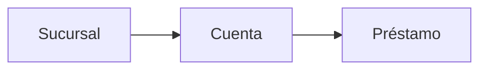

# README.md — Vistas en SQL Server

## 1. Objetivo

Este módulo presenta de forma práctica qué es una vista en SQL Server, para qué sirve y cómo ayuda a simplificar consultas, proteger datos y reutilizar lógica.

El enfoque principal será mostrar:

- qué es una vista,
- cómo se crea,
- qué limitaciones tiene,
- y cómo se puede usar para encapsular consultas complejas.

---

## 2. Base de datos para reproducir el ejemplo

Antes de trabajar con las vistas, es necesario crear las tablas base y cargar unos pocos registros.

```sql
IF OBJECT_ID('dbo.Prestamo', 'U') IS NOT NULL DROP TABLE dbo.Prestamo;
IF OBJECT_ID('dbo.Cuenta', 'U') IS NOT NULL DROP TABLE dbo.Cuenta;
IF OBJECT_ID('dbo.Sucursal', 'U') IS NOT NULL DROP TABLE dbo.Sucursal;
GO

CREATE TABLE Sucursal (
    SucursalID INT IDENTITY(1,1) PRIMARY KEY,
    nombre_sucursal VARCHAR(50) NOT NULL,
    ciudad_sucursal VARCHAR(50) NOT NULL,
    activos DECIMAL(10,2) NOT NULL
);
GO

CREATE TABLE Cuenta (
    CuentaID INT IDENTITY(1,1) PRIMARY KEY,
    numero_cuenta VARCHAR(20) NOT NULL,
    saldo DECIMAL(10,2) NOT NULL,
    SucursalID INT NOT NULL REFERENCES Sucursal(SucursalID)
);
GO

CREATE TABLE Prestamo (
    PrestamoID INT IDENTITY(1,1) PRIMARY KEY,
    numero_prestamo VARCHAR(20) NOT NULL,
    monto DECIMAL(10,2) NOT NULL,
    CuentaID INT NOT NULL REFERENCES Cuenta(CuentaID)
);
GO

INSERT INTO Sucursal (nombre_sucursal, ciudad_sucursal, activos) VALUES
('Central', 'San José', 5000000),
('Norte', 'Heredia', 3000000),
('Pacífico', 'Puntarenas', 1500000);
GO

INSERT INTO Cuenta (numero_cuenta, saldo, SucursalID) VALUES
('1001', 2500, 1),
('1002', 6000, 1),
('2001', 4500, 2),
('3001', 7000, 3);
GO

INSERT INTO Prestamo (numero_prestamo, monto, CuentaID) VALUES
('P-001', 120000, 1),
('P-002', 85000, 2),
('P-003', 50000, 3),
('P-004', 98000, 4);
GO
```

---

## 3. Glosario de las tablas

- **Sucursal**: almacena las sucursales del negocio.
- **Cuenta**: representa las cuentas asociadas a una sucursal.
- **Prestamo**: guarda los préstamos realizados sobre una cuenta.

### Relación entre tablas



Esto significa que:

1. una sucursal puede tener muchas cuentas,
2. una cuenta puede tener muchos préstamos,
3. y las vistas ayudan a trabajar con esa información de forma más ordenada.

---

## 4. ¿Qué es una vista?

Una vista es un objeto de base de datos que guarda una consulta `SELECT` y la expone como si fuera una tabla virtual.

### Principales utilidades de una vista

1. **Ocultar información**
   - Se pueden mostrar solo algunas columnas o filas.

2. **Reutilizar código**
   - En vez de repetir la misma consulta, se crea una vista.

3. **Mejorar la legibilidad**
   - Una vista con buen nombre funciona como documentación ejecutable.

4. **Simplificar permisos**
   - Se otorgan permisos sobre la vista y no directamente sobre la tabla base.

5. **Encapsular lógica compleja**
   - Se deja la lógica en una vista y luego solo se consulta.

> Nota: en SQL Server, una vista no almacena datos físicamente; solo guarda la definición de la consulta.

---

## 5. Ejemplo 1: crear una vista para restringir campos

Esta vista expone solo algunos campos de la tabla `Prestamo`.

```sql
CREATE OR ALTER VIEW view_contrato AS
SELECT
    numero_prestamo AS contrato,
    monto AS monto
FROM Prestamo (NOLOCK);
GO
```

### Uso de la vista

```sql
SELECT *
FROM view_contrato;
GO
```

### ¿Por qué es útil?

- oculta otras columnas que quizá no se deben mostrar,
- da nombres más claros para el negocio,
- y facilita el acceso a los datos más usados.

---

## 6. Ejemplo 2: la vista no puede tener ORDER BY en su definición

En SQL Server, una vista no puede llevar `ORDER BY` directamente en su definición, salvo que también use `TOP`.

```sql
CREATE OR ALTER VIEW view_contrato AS
SELECT
    numero_prestamo AS contrato,
    monto AS monto
FROM Prestamo (NOLOCK)
ORDER BY monto;
GO
```

Este ejemplo generará error porque el `ORDER BY` está dentro de la definición de la vista.

### Forma correcta

```sql
SELECT *
FROM view_contrato
ORDER BY monto;
GO
```

### Explicación

El orden se define cuando se consulta la vista, no dentro de su definición.

---

## 7. Ejemplo 3: campos calculados deben llevar alias

Si una vista incluye una expresión calculada, es recomendable asignarle un nombre claro.

```sql
CREATE OR ALTER VIEW view_contrato AS
SELECT
    numero_prestamo AS contrato,
    monto AS monto,
    monto * 1.05 AS monto_extendido
FROM Prestamo (NOLOCK);
GO
```

### Uso

```sql
SELECT *
FROM view_contrato
ORDER BY monto_extendido DESC;
GO
```

### ¿Por qué importa?

- el campo calculado queda con un nombre legible,
- evita resultados como `Expr1`,
- y mejora la comprensión del resultado.

---

## 8. Ejemplo 4: usar CTE y luego convertirlo en vista

Antes de crear una vista, es útil entender el problema con una consulta compleja.

### Consulta compleja con CTE (sin vista)

```sql
;WITH cte_cuenta AS (
    SELECT
        numero_cuenta,
        saldo,
        SucursalID
    FROM Cuenta
    WHERE saldo > 4000
)
SELECT
    sucursal.SucursalID,
    sucursal.nombre_sucursal,
    sucursal.ciudad_sucursal,
    cuenta.numero_cuenta,
    cuenta.saldo
FROM Sucursal AS sucursal
INNER JOIN cte_cuenta AS cuenta
    ON sucursal.SucursalID = cuenta.SucursalID;
GO
```

### Ventaja del CTE

- mejora la legibilidad,
- divide la consulta en pasos,
- y facilita filtrar primero y unir después.

### La misma lógica convertida en vista

```sql
CREATE OR ALTER VIEW view_mayor4K AS
WITH cte_cuenta AS (
    SELECT
        numero_cuenta,
        saldo,
        SucursalID
    FROM Cuenta
    WHERE saldo > 4000
)
SELECT
    sucursal.SucursalID,
    sucursal.nombre_sucursal,
    sucursal.ciudad_sucursal,
    cuenta.numero_cuenta,
    cuenta.saldo
FROM Sucursal AS sucursal
INNER JOIN cte_cuenta AS cuenta
    ON sucursal.SucursalID = cuenta.SucursalID;
GO
```

### Uso de la vista

```sql
SELECT *
FROM view_mayor4K;
GO
```

---

## 9. Ejemplo 5: vistas actualizables

Una vista puede permitir operaciones de lectura y, en algunos casos, también escritura.

```sql
CREATE OR ALTER VIEW view_sucursales AS
SELECT
    nombre_sucursal,
    ciudad_sucursal,
    activos
FROM Sucursal;
GO
```

### Consultar la vista

```sql
SELECT *
FROM view_sucursales;
GO
```

### Insertar mediante la vista

```sql
INSERT INTO view_sucursales (nombre_sucursal, ciudad_sucursal, activos)
VALUES ('Santa Ana', 'Santa Ana', 0);
GO
```

### Verificar el resultado

```sql
SELECT *
FROM Sucursal;
GO
```

---

## 10. Ejemplo 6: vista que no expone todos los campos requeridos

No todas las vistas son aptas para insertar datos.

```sql
CREATE OR ALTER VIEW view_sucursales_sin_activos AS
SELECT
    nombre_sucursal,
    ciudad_sucursal
FROM Sucursal;
GO
```

### Intentar insertar con esta vista

```sql
INSERT INTO view_sucursales_sin_activos (nombre_sucursal, ciudad_sucursal)
VALUES ('Tiquicia', 'Tiquicia');
GO
```

Este insert puede fallar si la tabla base exige que `activos` tenga un valor y la vista no lo expone.

### Explicación

Una vista solo puede insertar datos si la tabla base puede recibirlos correctamente a través de las columnas expuestas por la vista.

---

## 11. Resumen final

Las vistas son útiles porque:

- permiten ocultar información,
- reutilizan consultas complejas,
- simplifican el acceso a datos,
- y ayudan a organizar la lógica de negocio.

### Regla práctica

- Si una consulta se usa muchas veces, convertirla en vista suele ser una buena idea.
- Si la vista va a usarse para escritura, debe exponer todos los campos necesarios.

---

## 12. Sugerencia de estudio

Pruebe a modificar los ejemplos:

- cambie el filtro de `saldo > 4000` por otro valor,
- cree una vista nueva con otra columna,
- y observe cómo cambia la forma de consultar la información.

Esto ayudará a comprender mejor el papel de las vistas dentro de una base de datos.
