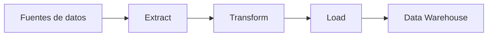

# ETL y relacionados  
## Capítulo 4 — Tópicos de Bases de Datos

Este capítulo introduce uno de los conceptos más importantes en la arquitectura de datos moderna: el proceso de **ETL**. En sistemas reales, la información suele vivir en varias fuentes distintas, con formatos diferentes, niveles de calidad variables y objetivos de uso distintos. Por eso, antes de analizar datos, muchas organizaciones requieren un flujo estructurado que permita llevar esos datos desde su origen hasta un repositorio preparado para consultas y reportes.

La idea central de este tema es comprender que el valor de la información no depende solamente de recopilar datos, sino de organizarlos, limpiarlos y ponerlos en un formato útil para la toma de decisiones.

---

# 1. Idea central

El proceso **ETL** significa **Extract, Transform and Load**: extraer, transformar y cargar.

En términos sencillos, esto describe una secuencia de trabajo mediante la cual los datos son:

1. **Extraídos** desde diferentes fuentes de origen.
2. **Transformados** para corregir inconsistencias, normalizar formatos y preparar la estructura adecuada para análisis.
3. **Cargados** en un sistema de almacenamiento analítico donde puedan consultarse de forma eficiente.

Este flujo es esencial en entornos donde la empresa necesita consolidar información de ventas, inventario, clientes, finanzas, operaciones o comportamiento del usuario, y luego usarla para análisis, reportes y soporte a decisiones.

---

# 2. ETL: Extract, Transform and Load

## 2.1 Extract

La primera etapa consiste en **extraer** información desde diversas fuentes. Estas fuentes pueden incluir:

- sistemas transaccionales,
- archivos planos,
- hojas de cálculo,
- servicios web,
- APIs,
- registros generados por aplicaciones,
- sensores o dispositivos conectados.

En la práctica, una organización puede tener datos dispersos en varias plataformas. La extracción busca reunir esa información en un punto común para poder trabajar con ella de manera uniforme.

## 2.2 Transform

La etapa de **transformación** es la más importante desde el punto de vista de calidad y consistencia. Aquí los datos se limpian y reestructuran. Algunas tareas comunes son:

- eliminar duplicados,
- corregir errores de formato,
- normalizar nombres o códigos,
- convertir unidades,
- completar información faltante,
- agregar o desagregar niveles de detalle,
- relacionar campos provenientes de distintas fuentes.

La transformación permite que los datos lleguen listos para análisis, no simplemente como una copia de los sistemas operativos.

## 2.3 Load

Finalmente, la etapa de **carga** lleva los datos ya transformados a un repositorio de destino. Este destino suele ser un **almacén de datos** o un **data warehouse**, donde la información se organiza para responder preguntas analíticas de forma rápida y consistente.

La carga puede hacerse de forma:

- **completa**, cuando se vuelve a cargar todo el conjunto de datos;
- **incremental**, cuando se insertan solo los cambios nuevos;
- **programada**, cuando se ejecuta en intervalos determinados por el negocio.

## 2.4 Diagrama simple del flujo



Este flujo puede visualizarse como una secuencia lógica: primero se reúnen los datos, luego se limpian y reorganizan, y finalmente se almacenan en un repositorio analítico preparado para consultas.

---

# 3. ¿Por qué es necesario ETL?

El ETL surge porque los sistemas transaccionales y los sistemas analíticos no siempre cumplen el mismo propósito.

Los sistemas operativos están diseñados para registrar y procesar actividades del día a día: ventas, pagos, entregas, movimientos internos, pedidos y actualizaciones en tiempo real. Sin embargo, esos mismos datos suelen estar dispersos, desordenados y pensados para operaciones más que para análisis.

Por eso, una organización necesita un proceso intermedio que prepare la información para responder preguntas como:

- ¿Cuáles son las ventas por región?
- ¿Qué producto tuvo el mejor desempeño en el último trimestre?
- ¿Cuánto ha crecido la demanda en comparación con el año anterior?
- ¿Qué patrones se repiten en el comportamiento de los clientes?

El ETL convierte datos operativos en información útil para el análisis estratégico.

## 3.1 Ejemplo de transformación sencilla con SQL

Supongamos que una fuente cruda guarda registros de ventas en una tabla llamada `ventas_raw`. En una etapa de preparación, se normalizan los datos antes de cargarlos al almacén analítico.

```sql
CREATE TABLE ventas_raw (
    cliente VARCHAR(100),
    producto VARCHAR(100),
    fecha_venta VARCHAR(20),
    monto VARCHAR(20)
);

INSERT INTO ventas_raw(cliente, producto, fecha_venta, monto)
VALUES ('  ana perez ', ' laptop ', '2026-07-01', '1,250.00');

CREATE TABLE ventas_stage (
    cliente VARCHAR(100),
    producto VARCHAR(100),
    fecha_venta DATE,
    monto DECIMAL(10,2)
);

INSERT INTO ventas_stage (cliente, producto, fecha_venta, monto)
SELECT
    UPPER(TRIM(cliente)) AS cliente,
    UPPER(TRIM(producto)) AS producto,
    CONVERT(DATE, fecha_venta) AS fecha_venta,
    CAST(REPLACE(monto, ',', '.') AS DECIMAL(10,2)) AS monto
FROM ventas_raw
WHERE cliente IS NOT NULL;
```

En este ejemplo, la etapa de transformación corrige espacios, estandariza texto y convierte una cadena de texto en un valor numérico y una fecha útil para análisis.

---

# 4. ETL y el almacenamiento analítico

El resultado del ETL normalmente se guarda en un **almacén de datos** o **data warehouse**. Este tipo de almacenamiento no está pensado para soportar la operación diaria de una empresa, sino para responder consultas analíticas con volumen grande de datos, agregaciones y reportes históricos.

Un almacén de datos suele estar orientado a:

- consultas de lectura intensiva,
- análisis histórico,
- consolidación de información de varias fuentes,
- soporte a reportes y dashboards,
- mejora en la velocidad de consulta para decisiones empresariales.

La principal idea es separar la carga operativa del uso analítico, evitando que los sistemas de transacción cotidiana se saturen con consultas complejas de análisis.

---

# 5. Esquema en estrella

Dentro de un almacén de datos, una de las estructuras más comunes es el **esquema en estrella**.

Este esquema organiza la información alrededor de una tabla central llamada **tabla de hechos** y varias tablas de dimensión alrededor de ella.

## 5.1 Tabla de hechos

La **tabla de hechos** contiene la información medible del negocio. Por ejemplo:

- ventas,
- cantidades,
- importes,
- descuentos,
- unidades vendidas,
- tiempos de proceso.

Cada fila de la tabla de hechos suele representar un evento o una transacción empresarial concreta.

## 5.2 Tablas de dimensión

Las **tablas de dimensión** describen el contexto del hecho. Por ejemplo:

- clientes,
- productos,
- fechas,
- regiones,
- vendedores,
- canales de venta.

Estas tablas ayudan a interpretar las métricas de la tabla de hechos, permitiendo analizar el mismo dato desde distintos ángulos.

## 5.3 ¿Por qué este modelo es útil?

El esquema en estrella facilita:

- consultas más simples,
- mejor legibilidad de los reportes,
- menor complejidad en la navegación de la información,
- rendimiento adecuado para análisis multidimensional.

Es una estructura muy común en data warehouses porque permite mapear el negocio de manera directa y comprensible.

---

# 6. OLAP y OLTP: dos enfoques distintos

Los sistemas de bases de datos suelen dividirse entre dos modelos de uso principales: **OLTP** y **OLAP**.

## 6.1 OLTP

**OLTP** (Online Transaction Processing) se orienta a operaciones de transacción de negocio en tiempo real. Aquí el foco es:

- registrar cambios y eventos,
- atender muchas operaciones pequeñas,
- mantener consistencia en la información,
- responder rápidamente a acciones de usuario o procesos internos.

Ejemplos típicos son:

- ventas en línea,
- reservas,
- pagos,
- sistemas bancarios,
- gestión de inventario.

## 6.2 OLAP

**OLAP** (Online Analytical Processing) se orienta al análisis de información histórica y agregada. El foco está en:

- consultas complejas,
- comparación de tendencias,
- análisis por dimensiones,
- reportes y dashboards,
- soporte a la toma de decisiones.

En este contexto, la prioridad no es registrar operaciones de forma inmediata, sino consultar grandes volúmenes de datos con rapidez y organización.

## 6.3 Diferencia clave

La diferencia esencial es esta:

- **OLTP** se preocupa por la operación del negocio.
- **OLAP** se preocupa por el análisis del negocio.

Por eso, muchas empresas mantienen sistemas operativos separados de los almacenes analíticos. El primero registra, el segundo interpreta.

---

# 7. Relación entre ETL, esquema en estrella y OLAP

Estos conceptos no son independientes; forman parte de una misma arquitectura lógica para trabajar con datos a nivel estratégico.

- El **ETL** organiza la extracción, limpieza y carga de la información.
- El **esquema en estrella** define una forma clara de estructurar los datos analíticos.
- El **OLAP** representa la forma en que esos datos se consultan para análisis.

En conjunto, estos elementos permiten construir una base para la inteligencia de negocio, porque convierten la información operativa en una fuente analítica preparada para responder preguntas complejas.

---

# 8. ETL, ELT y otros enfoques relacionados

Además de ETL, existen variantes y enfoques complementarios que muchas organizaciones usan según el tipo de infraestructura y el volumen de datos.

## 8.1 ELT

En **ELT** la secuencia se invierte: primero se **cargan** los datos en un almacenamiento de gran capacidad y luego se ejecutan las transformaciones dentro del propio repositorio analítico. Es muy útil cuando el motor de destino tiene suficiente capacidad de procesamiento y se desea aprovechar su potencia para transformar grandes volúmenes de información.

## 8.2 CDC (Change Data Capture)

El **CDC** consiste en capturar cambios incrementales desde una fuente de datos. En lugar de volver a procesar todo el conjunto, se detectan solo las novedades. Esto reduce costo de procesamiento y mejora la eficiencia en cargas frecuentes.

## 8.3 Ingesta en tiempo real o streaming

En algunos escenarios, no basta con cargas periódicas. El flujo de datos puede ser continuo, produciendo eventos en tiempo casi real para análisis de comportamiento, monitoreo, alertas o dashboards dinámicos.

## 8.4 Data lake y data warehouse

Si bien ambos almacenan datos para análisis, el **data lake** suele aceptar datos en formatos más variados y menos estructurados, mientras que el **data warehouse** se enfoca en información organizada y preparada para consulta analítica.

La elección depende del tipo de análisis requerido, la velocidad de procesamiento y la complejidad del modelo de datos.

## 8.5 Plataformas y fabricantes comunes

En la práctica profesional, el ETL y el ELT se implementan con plataformas que ayudan a diseñar, automatizar y gobernar flujos de datos.

- **Databricks**: se destaca por su enfoque en lakehouse, notebooks y procesamiento analítico escalable.
- **Dataiku**: ofrece una plataforma de diseño visual para ingeniería de datos y ciencia de datos, con flujo de trabajo colaborativo.
- **Microsoft**: con **Microsoft Fabric**, integra almacenamiento, integración, análisis y visualización en una sola experiencia de datos.
- **Talend**: es una solución tradicional orientada a integración de datos y automatización de pipelines ETL/ELT.
- **Informatica**: es una plataforma empresarial reconocida para integración, calidad y gobernanza de datos.

Estas herramientas no reemplazan el concepto, sino que lo materializan en soluciones reales para entornos empresariales y analíticos.

---

# 9. Conclusión

ETL, esquema en estrella y OLAP son conceptos que aparecen juntos cuando una organización quiere transformar datos operativos en información útil para la decisión.

El proceso ETL permite mover y preparar la información;
El esquema en estrella permite modelarla de manera clara para análisis;
Y OLAP ofrece el marco de consulta para explorar esa información con sentido empresarial.

En otras palabras, la base de datos no solo sirve para guardar información, sino también para convertirla en conocimiento.

---

## Glosario breve

- **ETL**: proceso de extracción, transformación y carga de datos.
- **ELT**: flujo en el que los datos se cargan primero y se transforman después.
- **CDC**: captura de cambios incrementales entre una fuente y un destino.
- **Data warehouse**: repositorio analítico centralizado para consultas y reportes.
- **Data lake**: almacenamiento de datos con gran variedad de formatos y niveles de estructuración.
- **Tabla de hechos**: tabla que almacena eventos o métricas medibles.
- **Tabla de dimensión**: tabla que describe el contexto de los hechos.
- **OLTP**: procesamiento de transacciones operativas.
- **OLAP**: procesamiento analítico de datos para consulta y análisis.

---

## Mini idea para ejercicio

Proponga un flujo simple de ETL para una tienda en línea:

1. Extraer los pedidos desde el sistema transaccional.
2. Transformar los datos para estandarizar clientes, productos y fechas.
3. Cargar la información en un almacén analítico.
4. Consultar la información con un esquema en estrella para responder preguntas de ventas por región, producto y tiempo.

---

## Ejemplo práctico complementario

El siguiente archivo presenta una simulación más detallada en SQL Server con creación de tablas, inserciones, dimensiones, hechos y explicación del uso de `MERGE`:

- [04.1-etl-y-relacionados.md](04.1-etl-y-relacionados.md)
