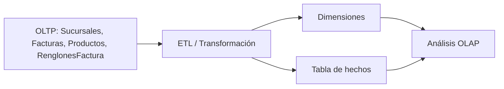

# ETL/OLAP: ejemplo práctico en SQL Server  
## Capítulo 4.1 — Tópicos de Bases de Datos

Este archivo presenta un ejemplo didáctico de cómo un conjunto de tablas operativas puede convertirse en un modelo analítico usando un flujo de ETL/OLAP. El objetivo no es solo ejecutar código, sino comprender qué ocurre en cada etapa: desde la captura de transacciones en un sistema OLTP hasta la construcción de dimensiones y hechos para análisis.

La idea principal es separar dos mundos:

- **OLTP**: registra operaciones del negocio en tiempo real.
- **OLAP**: prepara esos datos para consulta, agregación y análisis histórico.

En este ejemplo, la base operativa se construye con tablas como `Sucursales`, `Facturas`, `Productos` y `RenglonesFactura`. Luego se crean dimensiones y una tabla de hechos llamada `FactVenta` para representar el modelo analítico.

# 1. Objetivo del ejemplo

Este ejercicio simula un flujo de datos de la siguiente forma:

1. Crear una base de datos de ejemplo.
2. Cargar datos transaccionales de una operación comercial.
3. Preparar una capa analítica con dimensiones (`DimSucursal`, `DimProducto`, `DimCategoria`).
4. Construir una tabla de hechos (`FactVenta`) para responder preguntas de negocio.
5. Usar `MERGE` para sincronizar los datos entre la fuente y el almacén analítico.

El ejemplo es didáctico y sirve para visualizar cómo se transforma información operativa en información útil para análisis.

---

# 2. Diagrama conceptual



La idea es clara: las tablas transaccionales alimentan el proceso de extracción y transformación; luego esas entradas se convierten en dimensiones y hechos para ejecutar consultas analíticas.

---

# 3. Crear la base de datos y preparar el entorno

En SQL Server, el primer paso es crear una base de datos de trabajo. Esto se hace una sola vez y sirve para aislar el ejercicio del resto del sistema.

```sql
CREATE DATABASE ETL_OLAP_DEMO;
GO

USE ETL_OLAP_DEMO;
GO
```

### ¿Qué hace esta sección?

- `CREATE DATABASE` crea un contenedor lógico para el ejercicio.
- `USE` selecciona esa base para ejecutar las instrucciones siguientes.
- Todo el ejemplo se mantiene aislado en un entorno controlado.

---

# 4. La sección OLTP: crear tablas y registros de prueba

La parte de OLTP representa el origen de los datos. Aquí se modelan las operaciones de negocio del día a día: sucursales, facturas y renglones de compra.

## 4.1 Tabla de sucursales

```sql
CREATE TABLE Sucursales (
    Sucursal    VARCHAR(10) NOT NULL PRIMARY KEY,
    Direccion   VARCHAR(100) NOT NULL,
    Latitud     DECIMAL(10,6) NOT NULL,
    Longitud    DECIMAL(10,6) NOT NULL
)
GO
```

### ¿Qué hace esta tabla?

`Sucursales` almacena la información geográfica y de ubicación de cada punto de venta. Esta tabla es una entidad operacional porque describe dónde se realizaron las transacciones.

### Datos de prueba

```sql
INSERT INTO Sucursales (Sucursal, Direccion, Latitud, Longitud) VALUES
('00001', 'Bella Vista', 10.668900, -71.612000),
('00002', '5 de Julio', 10.673500, -71.612800),
('00003', 'Delicias',    10.661800, -71.620500)
GO

INSERT INTO Sucursales (Sucursal, Direccion, Latitud, Longitud) VALUES
('00004', 'La Limpia',        10.654200, -71.640300),
('00005', 'Cecilio Acosta',   10.661900, -71.617800),
('00006', 'Veritas',          10.665700, -71.603900),
('00007', 'El Milagro',       10.683200, -71.612500),
('00008', 'Indio Mara',       10.670800, -71.626200),
('00009', 'Santa Rita',       10.676900, -71.598700),
('00010','La Lago',           10.677800, -71.612300)
GO
```

### ¿Qué hace el `INSERT`?

La instrucción `INSERT` llena la tabla con datos reales de ejemplo. En un sistema transaccional, estas filas representarían registros de operación del negocio.

---

## 4.2 Tabla de facturas

```sql
CREATE TABLE Facturas (
    Factura     VARCHAR(10)   NOT NULL PRIMARY KEY,
    Fecha       DATE          NOT NULL,
    Hora        TIME(0)       NOT NULL,
    Sucursal    VARCHAR(10)   NOT NULL
)
GO 
```

Las facturas se usan para registrar cada operación comercial. Cuentan con fecha, hora y la sucursal que emitió la factura.

```sql
INSERT INTO Facturas (Factura, Fecha, Hora, Sucursal) VALUES
('00001', '2026-01-05', '10:05', '00001'),
('00002', '2026-01-06', '13:35', '00001'),
('00003', '2026-01-07', '14:18', '00002'),
('00004', '2026-01-08', '13:35', '00001'),
('00005', '2026-01-09', '23:14', '00001'),
('00006', '2026-01-10', '19:05', '00003')
GO

INSERT INTO Facturas (Factura, Fecha, Hora, Sucursal) VALUES
('00007', '2026-01-11', '11:20', '00004'),
('00008', '2026-01-12', '16:45', '00005'),
('00009', '2026-01-13', '09:55', '00006'),
('00010', '2026-01-14', '18:30', '00007'),
('00011', '2026-01-15', '12:10', '00008'),
('00012', '2026-01-16', '14:25', '00009'),
('00013', '2026-01-17', '20:40', '00010');
GO
```

### ¿Qué representa esta tabla?

Una factura es un hecho de negocio. Se puede decir que cada factura es un evento que se registra en el sistema operativo. El análisis posterior se hará sobre esos eventos.

---

## 4.3 Tabla de productos

```sql
CREATE TABLE Productos (
    Prod       VARCHAR(5)   NOT NULL PRIMARY KEY,
    Categoria  VARCHAR(50)  NOT NULL
)
GO

INSERT INTO Productos (Prod, Categoria) VALUES
('A', 'Abarrotes'),
('B', 'Textil'),
('C', 'Textil'),
('D', 'Bebidas'),
('E', 'Carnes')
GO
```

### ¿Qué hace esta tabla?

`Productos` sirve como referencia maestra para los diferentes artículos vendidos. Aquí se describe la categoría del producto y se facilita la agrupación analítica.

---

## 4.4 Tabla de renglones de factura

```sql
CREATE TABLE RenglonesFactura (
    Renglon   VARCHAR(10)  NOT NULL PRIMARY KEY,
    Prod      VARCHAR(5)   NOT NULL,
    Cant      DECIMAL(10,2) NOT NULL,
    Precio    DECIMAL(10,2) NOT NULL,
    Costo     DECIMAL(10,2) NOT NULL,
    Factura   VARCHAR(10)  NOT NULL,
    FOREIGN KEY (Prod) REFERENCES Productos(Prod),
    FOREIGN KEY (Factura) REFERENCES Facturas(Factura)
)
GO
```

Los renglones son la parte más importante para análisis porque contienen cantidades, precios, costos y el vínculo con la factura. Es aquí donde se genera la métrica de negocio.

```sql
INSERT INTO RenglonesFactura (Renglon, Prod, Cant, Precio, Costo, Factura) VALUES
('00001','A',10.00,15.00,10.00,'00001'),
('00002','B',15.00,20.00,17.00,'00001'),
('00003','C', 2.00,35.00,30.00,'00001'),
('00004','D', 4.00,18.00,12.00,'00001'),
('00005','E', 1.00,15.00,11.00,'00001'),
('00006','A', 5.00,15.00,10.00,'00002'),
('00007','E', 1.00,15.00,11.00,'00002'),
('00008','B', 1.00,20.00,17.00,'00002'),
('00009','C', 1.00,35.00,30.00,'00003'),
('00010','A',10.00,15.00,10.00,'00004'),
('00011','B',15.00,20.00,17.00,'00004'),
('00012','C', 2.00,35.00,30.00,'00004'),
('00013','D', 4.00,18.00,12.00,'00005'),
('00014','E', 1.00,15.00,11.00,'00005'),
('00015','A', 5.00,15.00,10.00,'00005'),
('00016','E', 1.00,15.00,11.00,'00006'),
('00017','B', 1.00,20.00,17.00,'00006'),
('00018','C', 1.00,35.00,30.00,'00006')
GO

INSERT INTO RenglonesFactura (Renglon, Prod, Cant, Precio, Costo, Factura) VALUES
('00019','A', 8.00, 15.00, 10.00,'00007'),
('00020','C', 1.00, 35.00, 30.00,'00007'),
('00021','B', 3.00, 20.00, 17.00,'00008'),
('00022','E', 2.00, 15.00, 11.00,'00008'),
('00023','D', 6.00, 18.00, 12.00,'00009'),
('00024','A', 4.00, 15.00, 10.00,'00009'),
('00025','C', 2.00, 35.00, 30.00,'00010'),
('00026','B', 5.00, 20.00, 17.00,'00010'),
('00027','E', 1.00, 15.00, 11.00,'00011'),
('00028','A', 7.00, 15.00, 10.00,'00011'),
('00029','D', 3.00, 18.00, 12.00,'00012'),
('00030','C', 1.00, 35.00, 30.00,'00012'),
('00031','B', 4.00, 20.00, 17.00,'00013'),
('00032','E', 2.00, 15.00, 11.00,'00013');
GO
```

### ¿Qué representa esta información?

Los renglones muestran la parte granular de cada factura. Aquí aparece el detalle fino de la transacción. Este nivel de detalle es ideal para luego construir tablas de hechos analíticas.

---

# 5. La sección ETL/OLAP: crear dimensiones y cargar datos

En esta segunda etapa, el sistema deja de ser solo transaccional y empieza a prepararse para el análisis. Cada dimensión representa un contexto del negocio.

## 5.1 Dimensión de sucursal

```sql
CREATE TABLE DimSucursal (
    SucursalKey   INT IDENTITY(1,1) NOT NULL PRIMARY KEY,
    Sucursal      VARCHAR(10) NOT NULL,
    Direccion     VARCHAR(100) NOT NULL,
    Latitud       DECIMAL(10,6) NOT NULL,
    Longitud      DECIMAL(10,6) NOT NULL,
    FechaInicio   DATE NOT NULL DEFAULT(GETDATE()),
    FechaFin      DATE NULL,
    EsActual      BIT NOT NULL DEFAULT(1)
)
GO
```

### ¿Qué hace esta dimensión?

`DimSucursal` toma las sucursales del sistema operativo y las convierte en una dimensión del almacén analítico. La dimensión nos permite responder preguntas como: “¿Cuál sucursal generó más ventas?”

### Carga con `MERGE`

```sql
MERGE DimSucursal AS T
USING (
    SELECT 
        Sucursal,
        Direccion,
        Latitud,
        Longitud
    FROM Sucursales
) AS S
ON T.Sucursal = S.Sucursal

WHEN MATCHED AND (
        T.Direccion <> S.Direccion
     OR T.Latitud   <> S.Latitud
     OR T.Longitud  <> S.Longitud
)
THEN UPDATE SET
        T.Direccion = S.Direccion,
        T.Latitud   = S.Latitud,
        T.Longitud  = S.Longitud

WHEN NOT MATCHED BY TARGET
THEN INSERT (Sucursal, Direccion, Latitud, Longitud)
     VALUES (S.Sucursal, S.Direccion, S.Latitud, S.Longitud);

GO
```

### Explicación del `MERGE`

`MERGE` es una instrucción poderosa porque ejecuta, en una sola operación, tres acciones lógicas:

- **MATCHED**: si la fila ya existe, se actualiza.
- **NOT MATCHED BY TARGET**: si la fila no existe en la dimensión, se inserta.

Esto hace que la carga sea más uniforme y fácil de mantener. En términos de ETL, la idea es sincronizar una dimensión con la fuente operativa.

> En esta versión el ejemplo es sencillo, pero en escenarios reales se suele manejar evolución lenta de dimensión (SCD Type 2) para guardar historial cuando una fila cambia con el tiempo.

---

## 5.2 Dimensión de producto

```sql
CREATE TABLE DimProducto (
    ProductoKey   INT IDENTITY(1,1) NOT NULL PRIMARY KEY,
    Producto      VARCHAR(5) NOT NULL,
    Categoria     VARCHAR(50) NOT NULL,
    FechaInicio   DATE NOT NULL DEFAULT(GETDATE()),
    FechaFin      DATE NULL,
    EsActual      BIT NOT NULL DEFAULT(1)
)
go

MERGE DimProducto AS T
USING (
    SELECT 
        Prod AS Producto,
        Categoria
    FROM Productos
) AS S
ON T.Producto = S.Producto
WHEN MATCHED AND (
        T.Categoria <> S.Categoria
    )
THEN UPDATE SET
        T.Categoria = S.Categoria
WHEN NOT MATCHED BY TARGET
THEN INSERT (Producto, Categoria)
     VALUES (S.Producto, S.Categoria);
GO
```

### ¿Qué hace esta dimensión?

`DimProducto` clasifica los productos por categoría. De esta forma, el analista puede agrupar ventas por tipo de artículo y no solo por código del producto.

---

## 5.3 Dimensión de categoría

```sql
CREATE TABLE DimCategoria (
    CategoriaKey   INT IDENTITY(1,1) NOT NULL PRIMARY KEY,
    Categoria      VARCHAR(50) NOT NULL,
    FechaInicio    DATE NOT NULL DEFAULT(GETDATE()),
    FechaFin       DATE NULL,
    EsActual       BIT NOT NULL DEFAULT(1)
)
GO

MERGE DimCategoria AS T
USING (
    SELECT DISTINCT
        Categoria
    FROM Productos
) AS S
ON T.Categoria = S.Categoria
WHEN NOT MATCHED BY TARGET
THEN INSERT (Categoria)
     VALUES (S.Categoria);
GO
```

### ¿Qué hace esta dimensión?

La dimensión de categoría elimina redundancia y prepara una estructura más limpia para el análisis multidimensional. En lugar de repetir texto, se usa una dimensión que agrupa las categorías.

---

# 6. Construcción de la tabla de hechos `FactVenta`

La tabla de hechos es el núcleo del almacén analítico. Mientras las dimensiones describen el contexto, la tabla de hechos contiene la métrica medible: ventas, cantidades, precios y costos.

```sql
CREATE TABLE FactVenta (
    FactVentaKey     INT IDENTITY(1,1) NOT NULL PRIMARY KEY,
    ProductoKey      INT NOT NULL,
    CategoriaKey     INT NOT NULL,
    SucursalKey      INT NOT NULL,
    Factura          VARCHAR(10) NOT NULL,
    Cant             DECIMAL(10,2) NOT NULL,
    Precio           DECIMAL(10,2) NOT NULL,
    Costo            DECIMAL(10,2) NOT NULL,
    Subtotal         DECIMAL(10,2) NOT NULL,
    Ganancia         DECIMAL(10,2) NOT NULL,
    HoraFull         TIME(0) NOT NULL,
    Hora             INT NOT NULL,
    FOREIGN KEY (ProductoKey) REFERENCES DimProducto(ProductoKey),
    FOREIGN KEY (CategoriaKey) REFERENCES DimCategoria(CategoriaKey),
    FOREIGN KEY (SucursalKey) REFERENCES DimSucursal(SucursalKey)
)
GO
```

### ¿Qué hace esta tabla?

`FactVenta` almacena los eventos de venta. Cada fila representa un registro que puede resumirse por producto, categoría, sucursal, hora o factura. Es la pieza central para consultas de análisis.

---

# 7. Carga de la tabla de hechos con `MERGE`

La carga final consiste en llevar los datos operativos hacia un modelo analítico. Aquí se calculan campos derivados e indicadores de negocio.

```sql
MERGE FactVenta AS T
USING (
    SELECT
        RF.Prod,
        RF.Cant,
        RF.Precio,
        RF.Costo,
        RF.Factura,
        (RF.Cant * RF.Precio) AS Subtotal,
        PR.Categoria,
        F.Sucursal,
        F.Hora AS HoraFull,
        DATEPART(HOUR, F.Hora) AS Hora
    FROM RenglonesFactura RF
    INNER JOIN Facturas F ON RF.Factura = F.Factura
    INNER JOIN Productos PR ON RF.Prod = PR.Prod
) AS S
ON  T.Factura = S.Factura
AND T.ProductoKey = (SELECT ProductoKey FROM DimProducto WHERE Producto = S.Prod)
AND T.Cant = S.Cant
AND T.Precio = S.Precio
AND T.Costo = S.Costo
WHEN MATCHED AND (
       T.Subtotal <> S.Subtotal
    OR T.Ganancia <> (S.Subtotal - (S.Cant * S.Costo))
    OR T.HoraFull <> S.HoraFull
    OR T.Hora <> S.Hora
    OR T.CategoriaKey <> (SELECT CategoriaKey FROM DimCategoria WHERE Categoria = S.Categoria)
    OR T.SucursalKey  <> (SELECT SucursalKey  FROM DimSucursal  WHERE Sucursal  = S.Sucursal)
)
THEN UPDATE SET
        T.CategoriaKey = (SELECT CategoriaKey FROM DimCategoria WHERE Categoria = S.Categoria),
        T.SucursalKey  = (SELECT SucursalKey  FROM DimSucursal  WHERE Sucursal  = S.Sucursal),
        T.Subtotal     = S.Subtotal,
        T.Ganancia     = S.Subtotal - (S.Cant * S.Costo),
        T.HoraFull     = S.HoraFull,
        T.Hora         = S.Hora
WHEN NOT MATCHED BY TARGET
THEN INSERT (
        ProductoKey,
        CategoriaKey,
        SucursalKey,
        Factura,
        Cant,
        Precio,
        Costo,
        Subtotal,
        Ganancia,
        HoraFull,
        Hora
)
VALUES (
        (SELECT ProductoKey FROM DimProducto   WHERE Producto = S.Prod),
        (SELECT CategoriaKey FROM DimCategoria WHERE Categoria = S.Categoria),
        (SELECT SucursalKey  FROM DimSucursal  WHERE Sucursal  = S.Sucursal),
        S.Factura,
        S.Cant,
        S.Precio,
        S.Costo,
        S.Subtotal,
        S.Subtotal - (S.Cant * S.Costo),
        S.HoraFull,
        S.Hora
);
GO
```

### Explicación paso a paso

1. La sección `USING (...)` arma una vista temporal con los datos que se quieren llevar al almacén.
2. El `ON` define la condición de coincidencia entre la tabla fuente y la tabla destino.
3. `WHEN MATCHED` significa que la fila ya existe y necesita actualizarse si cambió alguna métrica.
4. `WHEN NOT MATCHED BY TARGET` significa que la fila no existe en la tabla destino y debe insertarse.
5. Los cálculos de `Subtotal` y `Ganancia` son campos derivados de la operación comercial.
6. `Hora` se obtiene con `DATEPART(HOUR, F.Hora)` para facilitar análisis por franja horaria.

### ¿Por qué es importante este paso?

Este es el corazón del flujo ETL/OLAP: convertir transacciones detalladas en hechos medibles y comparables para el análisis.

---

# 8. Qué está ocurriendo conceptualmente

La diferencia entre las dos partes del ejercicio es importante:

## 8.1 Primera parte: OLTP

Las tablas de origen representan el sistema operativo del negocio:

- sucursales,
- facturas,
- productos,
- renglones de compra.

Estas tablas son la fuente de verdad transaccional y sirven para registrar lo que ocurre en el día a día.

## 8.2 Segunda parte: ETL/OLAP

Las tablas de dimensión y la tabla de hechos representan el uso analítico:

- `DimSucursal` responde a preguntas de ubicación.
- `DimProducto` responde a preguntas de producto.
- `DimCategoria` responde a preguntas de agrupación.
- `FactVenta` responde a preguntas de rendimiento y comportamiento comercial.

En otras palabras, la información se reorganiza para responder análisis, no solo para registrar eventos.

---

# 9. Preguntas de análisis que este modelo puede responder

Con esta estructura ya preparada, se pueden formular consultas como:

- ¿Cuál sucursal generó mayor margen de ganancia?
- ¿Qué categoría tuvo mayor volumen de venta?
- ¿En qué hora del día se venden más productos?
- ¿Qué factura tuvo mayor subtotal?
- ¿Qué producto es el más rentable por sucursal?

Estas preguntas son típicas de un entorno OLAP, donde el foco está en comparar tendencias, agrupar y resumir información.

---

# 10. Resumen final

El ejemplo demuestra una lógica muy común en la práctica:

1. El sistema OLTP guarda transacciones en tablas normales.
2. El flujo ETL extrae esos datos.
3. Las dimensiones reestructuran el contexto del negocio.
4. La tabla de hechos almacena el evento medible.
5. El `MERGE` actúa como una operación de sincronización y actualización incremental.

Esto convierte una base de datos operativa en una base de datos analítica preparada para consultas estratégicas.

---

## Glosario breve

- **OLTP**: procesamiento de transacciones operativas.
- **OLAP**: análisis de datos para consultas y toma de decisiones.
- **Dimensión**: tabla que describe el contexto del negocio.
- **Hecho**: tabla que almacena métricas o eventos medibles.
- **MERGE**: instrucción que combina `INSERT` y `UPDATE` según la coincidencia de filas.
- **ETL**: extracción, transformación y carga de datos.
